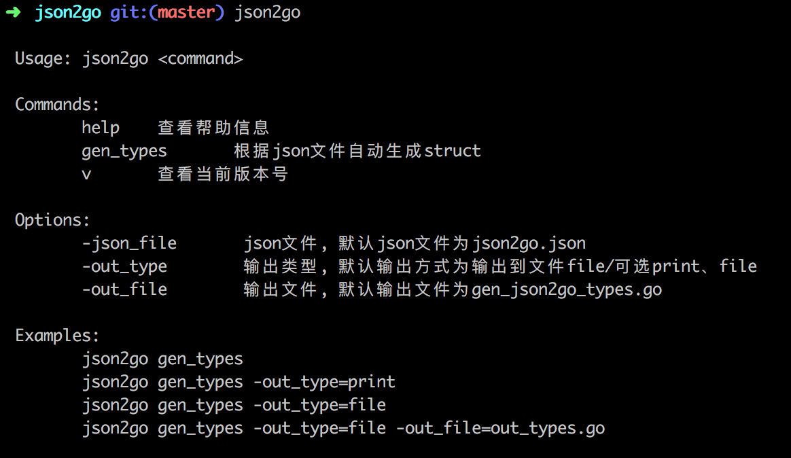

# json2go
[](https://travis-ci.org/usthooz/json2go)
[](https://goreportcard.com/report/github.com/usthooz/json2go)
[](http://godoc.org/github.com/usthooz//json2go)

Json转换为Go语言使用的结构体工具

### 功能
- 通过读取json文件生成Golang对应的结构体
- 可选输出方式为屏幕输出以及写入到文件

### 使用

#### 安装
```
go get github.com/usthooz/json2go
cd $GOPATH/github.com/usthooz/json2go
go install
```

#### 使用方法
- 帮助信息


- 新建json文件
- 使用命令将json文件转换为Golang结构体，可选择输出到文件以及屏幕
- 使用默认配置

```
json2go gen_types
```
- 输出到文件

```
json2go gen_types -out_type=file -out_file=out_types.go
```

- 输出到屏幕

```
json2go gen_types -out_type=print
```